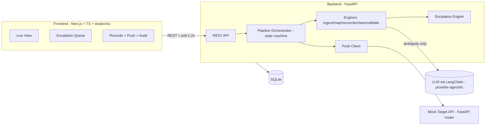
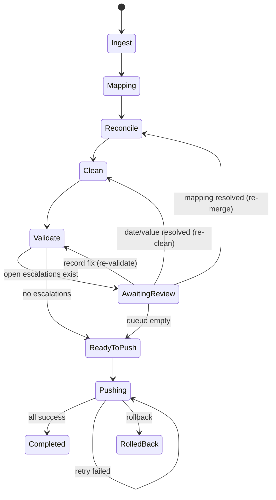

# PRD — AI Agent for Client Data Migration & Integration

> **Context:** Darwinbox Forward Deployed Engineer take-home. This document is the build spec for a coding agent. It is self-contained: read it top to bottom and you can build the MVP without external context.

---

## 1. Product goal (one sentence)

Build an agent that ingests messy, multi-file employee exports, autonomously maps → cleans → validates them against a target schema, pushes the result to a mock target API, and **escalates only genuinely ambiguous cases** to a non-technical consultant through a supervision UI — with a full audit trail.

## 2. Personas

| Persona | Needs |
|---|---|
| **Implementation Consultant** (primary UI user, non-technical) | Watch the agent work, resolve a short queue of ambiguous cases in one glance, trust that nothing was silently guessed. |
| **The Agent** (autonomous actor) | Do the safe majority alone; escalate only when confidence is low; log everything. |
| **Interview Panel** (evaluator) | See a defensible autonomy boundary, clean UX, and production-minded delta over "just an LLM". |

## 3. Core value proposition & success metrics

**Prove:** *Straight-Through Processing (STP) rate — % of fields/records migrated with zero human touch — with zero silent data corruption.*

| Metric | Target for demo |
|---|---|
| STP rate (auto-resolved fields) | ≥ 80% |
| Escalations surfaced | Small & sharp (3–5), each resolvable in one glance |
| Silent-corruption incidents | **0** (every uncertain case is escalated, never guessed) |
| Push success + retry/rollback | Demonstrated live on ≥1 failing record |

## 4. Scope — MoSCoW

**Must Have (demo-critical):** multi-file ingestion & reconciliation · deterministic mapping w/ confidence · LLM adjudication for ambiguity · auto-clean (dates/casing/whitespace/dedupe) · confidence-threshold escalation · HITL UI (live view + escalation queue + approve/correct/reject) · push to mock API w/ per-record status + retry · audit trail.

**Should Have:** rollback · confidence-threshold slider · STP metrics strip · SSE live feed.

**Could Have:** cross-session persistence beyond SQLite · multiple entity types · learning loop from human corrections.

**Won't Have (deliberate cuts):** real auth/RBAC · production DB/horizontal scale · real target system · large-file/streaming ingestion · model fine-tuning · hosted multi-tenant deployment.

## 5. System architecture



**Stack & rationale**

| Layer | Tech | Why |
|---|---|---|
| Frontend | Next.js (App Router) + TypeScript + TailwindCSS + shadcn/ui + TanStack Query (polling) | Fast, clean UI for a non-technical user; polling avoids websocket complexity. |
| Backend | FastAPI (Python 3.11+), Pydantic v2 | One language for the data core; typed async API. |
| Data libs | Pandas (ingest/clean), RapidFuzz (header match), python-dateutil (date parsing) | Deterministic, battle-tested. |
| LLM | **LangChain** provider-agnostic (`init_chat_model`) behind an `LLMClient` interface; provider/model/key from env (OpenAI / Anthropic / Groq / Gemini / local); **OSS models supported** (e.g. Llama via Groq / Ollama / HF) | Honors the brief's OSS-model constraint while staying provider-flexible; swappable/mockable. |
| Persistence | SQLite (default) via SQLModel/SQLAlchemy, selected by `DATABASE_URL` | Zero-ops local demo; ORM makes Supabase/Postgres a one-line swap later. |
| Mock target | FastAPI router with deterministic failures | Demo push/retry/rollback without a real system. |

**Deployment posture (chosen): local-first, cloud-ready.** The interview build runs entirely locally (SQLite + `uvicorn` + `next dev`). Every environment-specific value is injected via env vars so adopting cloud later is *configuration, not migration*:
- `DATABASE_URL` — SQLite locally → Supabase Postgres later (ORM abstracts the swap; avoid SQLite-only SQL).
- `NEXT_PUBLIC_API_URL` — frontend → local backend now → deployed backend URL later.
- `LLM_PROVIDER` / `LLM_MODEL` / provider API key — switch models with no code changes.
- Storage adapter — local `./uploads` now → Supabase Storage later.

**Known non-goal (state this in the interview):** FastAPI will *not* run on Vercel — serverless can't host the long-running, park/resume agent. If hosted later: **Next.js → Vercel, FastAPI → Render/Railway/Fly, DB → Supabase.** Nothing in the design blocks this.

## 6. Data model (SQLite default, Postgres-ready)

```
migration_run(id, name, status, config_json, stats_json, created_at, updated_at)
   status ∈ {created, ingesting, mapping, reconciling, cleaning, validating,
             awaiting_review, ready_to_push, pushing, completed, failed}

source_file(id, run_id→run, filename, entity, row_count, columns_json, uploaded_at)

field_mapping(id, run_id, source_file_id, source_column, target_field,
              method ∈ {alias, fuzzy, llm, manual}, confidence REAL,
              status ∈ {auto_applied, escalated, resolved, rejected},
              rationale, created_at)

record(id, run_id, natural_key, merged_json, source_refs_json,
       status ∈ {clean, needs_review, valid, invalid, pushed, push_failed, rolled_back},
       created_at, updated_at)

escalation(id, run_id, type, entity_ref, context_json, options_json,
           confidence REAL, status ∈ {open, resolved, rejected},
           resolution_json, resolved_by, resolved_at, created_at)
   type ∈ {ambiguous_mapping, value_conflict, ambiguous_date,
           validation_failure, unmapped_column, manager_unresolved}

audit_log(id, run_id, ts, actor ∈ {agent, human}, action, target_type,
          target_id, before_json, after_json, reason)

push_result(id, run_id, record_id, attempt, status ∈ {success, failed},
            http_status, error, request_json, created_at)
```

## 7. Agent pipeline (detailed logic)

State machine (orchestrator drives these; each transition writes audit entries):



**Stage detail:**

1. **Ingest** — parse CSV/Excel to dataframes; record columns & row counts; profile each column's dominant value type.
2. **Mapping** — per source column, resolve target field:
   - Exact alias match (case/space-insensitive) → `confidence = 1.0`, method `alias`.
   - Else RapidFuzz `token_sort_ratio` vs field names + aliases → best score.
   - **Decision (see §8):** auto-apply / escalate `ambiguous_mapping` / escalate `unmapped_column`. LLM adjudicates only the ambiguous/unmapped set.
3. **Reconcile / merge** — normalize IDs (`E1001`↔`1001`); match records across files on `match_keys` (email primary, id fallback). Merge fields into one target-shaped record. If two files give **different non-null values** for the same field → `value_conflict` escalation.
4. **Clean** — trim whitespace; normalize casing; apply `enum_normalization`; parse dates. **Per-column date format detection:** if a column has values consistent with a single format → auto-normalize to ISO; if genuinely ambiguous (e.g. day and month both ≤ 12 across rows AND cross-file disagreement) → `ambiguous_date` escalation, resolve once, apply column-wide. Light phone normalization.
5. **Validate** — Pydantic model from target schema (required present, email valid, date valid, enum valid). Auto-fix attempt once; **second failure → `validation_failure` escalation.**
6. **Human review gate** — run parks in `awaiting_review` while any escalation is `open`. Each resolution re-runs the minimal affected stage (mapping → re-merge; date/value → re-clean; record fix → re-validate).
7. **Push** — POST each `valid` record to mock target; record `push_result` per record; retry failed (max attempts from config); rollback available.
8. **Audit** — every agent decision and human action appends to `audit_log` with before/after + reason.

## 8. Confidence & escalation policy (the heart — be ready to defend this)

Config (tunable, stored in `migration_run.config_json`):

```
auto_apply_threshold = 0.90   # >= this → auto-apply mapping
min_map_threshold    = 0.70   # < this and no LLM confidence → unmapped_column
ambiguous_delta      = 0.08   # top-2 candidates within this → ambiguous_mapping
max_push_attempts    = 3
```

**Mapping decision:**
- `score ≥ 0.90` and single clear winner → **auto-apply**.
- top-2 within `ambiguous_delta` → send the tie (just the tied candidates, not the full schema) to the LLM; if it's confident (≥ `auto_apply_threshold`) → **auto-apply**, method `llm`; else **escalate `ambiguous_mapping`**. RapidFuzz has no semantic understanding, so a tie on character overlap doesn't mean the choice is genuinely unknowable — only escalate once the LLM has also had a shot at it.
- `0.70 ≤ score < 0.90`, single winner → auto-apply **with a low-confidence note** (surfaced in audit, not escalated).
- `score < 0.70` → send to LLM; if LLM confident → auto-apply w/ note; else **escalate `unmapped_column`**.

**Manager-lookup decision** (`manager_unresolved`, §9): a manager value that isn't an email is fuzzy-matched against the run's own known employee emails. `score ≥ auto_apply_threshold` → **auto-apply** the matched email, method `agent`, fully audited; otherwise **escalate**. Deliberately binary — no lower "low-confidence, audited" tier the way mapping has, because attaching the wrong person's email as someone's manager is exactly the "plausible-looking wrong answer" this whole policy exists to catch, not a formatting nicety.

**The line, stated plainly (for the write-up & panel):** the agent acts alone on anything **safe and verifiable** (high-similarity mappings, deterministic cleans, exact-duplicate removal). It escalates only where a **plausible-looking wrong answer is possible**: two viable target fields, conflicting values across files, an ambiguous date, or a record that fails validation twice. *Not everything. Not nothing.*

## 9. Escalation catalog (UI must render each with one-glance context)

| Type | Context shown | Resolution actions |
|---|---|---|
| `ambiguous_mapping` | source column + sample values + candidate target fields w/ scores | pick target · ignore column |
| `value_conflict` | record identity + field + each value w/ its source file | pick value · enter custom |
| `ambiguous_date` | column + sample raw values + candidate formats | pick format (applied column-wide) |
| `validation_failure` | record + field + error + current value | correct value · reject record |
| `unmapped_column` | source column + samples + nearest targets | map to field · drop column |
| `manager_unresolved` | manager name + closest email matches | enter email · leave null |

Every resolution = **approve / correct / reject**, writes an `audit_log` entry, and re-triggers the minimal affected stage.

## 10. API contract (REST)

```
POST   /api/runs                         -> create run {name}
POST   /api/runs/{id}/files              -> upload source files (multipart)
POST   /api/runs/{id}/start              -> start pipeline (async background task)
GET    /api/runs/{id}                    -> run status + stats
GET    /api/runs/{id}/activity?since=    -> activity feed (for live-view polling)
GET    /api/runs/{id}/mappings           -> proposed/final field mappings
GET    /api/runs/{id}/escalations?status=open  -> escalation queue
POST   /api/escalations/{id}/resolve     -> {action, value?}  approve/correct/reject
GET    /api/runs/{id}/records?status=    -> merged records + provenance
POST   /api/runs/{id}/push               -> push all valid records
POST   /api/runs/{id}/push/retry         -> retry failed records
POST   /api/runs/{id}/rollback           -> rollback pushed records
GET    /api/runs/{id}/audit              -> audit log

# Mock target (separate router, simulates the client's new platform)
POST   /api/mock-target/employees        -> create (deterministic failures)
DELETE /api/mock-target/employees/{key}  -> rollback support
```

**Mock target failure rule (deterministic, demo-safe):** fail records whose `email` domain is `gmail.com` OR whose `department` is missing, returning HTTP 422 with a reason — guarantees a retryable failure on camera.

## 11. UI specification (Next.js)

**Screens / components:**
1. **New Migration** — name + drag-drop source files → Start.
2. **Live View** — pipeline stepper (Ingest→…→Push), **activity feed** (polled), stats strip (STP %, records, escalations open/resolved, pushed/failed).
3. **Escalation Queue** — list of cards; each shows type badge, one-glance context (§9), and inline **Approve / Correct / Reject** controls; queue count decrements live.
4. **Records Table** — filter by status; row expand shows merged record + per-field provenance (which file each value came from).
5. **Push & Results** — per-record success/fail, **Retry failed**, **Rollback** buttons.
6. **Audit Log** — chronological, filterable by actor/action.

**UX principles:** non-technical friendly (plain language, no jargon), one-glance escalations, live-updating counts, everything the agent did is inspectable.

## 12. Audit trail spec

Every entry: `ts, actor(agent|human), action, target_type, target_id, before, after, reason`. Examples: `agent mapped 'DOJ'→'date_of_joining' (fuzzy 0.94)`; `agent normalized status 'ON LEAVE'→'on_leave'`; `human resolved value_conflict on email → chose work email (reason: canonical)`; `agent pushed E1001 (200)`; `agent retry E1005 (success)`.

## 13. Non-functional & constraints

- **Provider-agnostic AI via LangChain.** Model/provider chosen by env (`LLM_PROVIDER` / `LLM_MODEL` + key); OSS models supported to honor the brief. Runs with a mock `LLMClient` when no key is set — deterministic mapping still works, so the app degrades gracefully.
- **Local-first, cloud-ready.** SQLite + local run for the demo; all env-driven (`DATABASE_URL`, `NEXT_PUBLIC_API_URL`, LLM keys) so Supabase / Vercel / Render adoption is config, not a rewrite.
- Small files, in-memory processing (no streaming).
- Single-process, single-user, local run. Reproducible: deterministic path yields identical output across runs.
- Config-driven thresholds. **No secrets in code** — all keys via env.

## 14. Acceptance criteria → Darwinbox brief mapping

| Brief AC | Where satisfied |
|---|---|
| 1 Multi-file ingestion & reconciliation | §7 Ingest+Reconcile; 3 sample files w/ different headers |
| 2 Autonomous mapping & cleanup | §7 Mapping+Clean; §8 auto-apply path |
| 3 Defensible escalation boundary | §8 policy + §9 catalog |
| 4 Human-in-the-loop UI | §11 Live View + Escalation Queue |
| 5 Mock integration + retry/rollback + audit | §10 mock target, §7 Push, §12 audit |
| 6 Delta solutioning | confidence scoring, conflict detection, idempotent retry, audit, learning-loop (roadmap) |

## 15. Sample data (already provided)

`data/target_schema.yaml`, `data/source/{hr_export,crm_export,payroll_export}.csv`. Planted cases: header variance, `E1001`↔`1001` id mismatch, per-file date conventions (hr=dd/mm, crm=mm/dd — resolved silently once each file's own column evidence pins down its convention; genuinely irreconcilable disagreement still escalates as `ambiguous_date`), work-vs-personal email conflict (surfaces once `PersonalEmail` is mapped to `email` — see §16), unmapped `Grade`/`BankName`, ambiguous `EmploymentType` mapping, manager-as-name, missing-email enrichment, invalid `30/02/1985`, exact duplicate row. See repo README for the full mapping.

## 16. Demo script (must produce ≥1 resolved escalation on camera)

1. Upload 3 files → Start. 2. Watch live feed auto-map & clean the safe majority (STP % climbs to ~80%+). 3. Escalation queue shows ~9 items — more than the earlier "~4" estimate, because `payroll_export.csv` alone contributes 4 (PersonalEmail, Grade, BankName, EmploymentType) on top of the record-level ones; still small enough to resolve in one glance each. 4. Resolve **`unmapped_column` `PersonalEmail`** → map to `email` — this one resolution is also what makes the **email conflict** appear (until `PersonalEmail` has a target field, there's nothing competing with the work email, so the conflict has nothing to surface). Then resolve that conflict (pick work email) + **`ambiguous_mapping` `Grade`** (drop) live. 5. Push → one record (gmail/missing dept) fails → **Retry**/show rollback. 6. Open **Audit Log** to show the full record of what changed and why.

## 17. Assumptions & open questions

- Entity = `employees` only. Files are small CSVs. Delivery = local + recording (cloud-ready for optional later hosting).
- Open: default LLM provider/model to pin for the demo; whether SSE is worth it vs polling (default: polling).

---
*Companion doc: `docs/EPICS.md` — the build plan (epics, tasks, acceptance criteria, order).*
